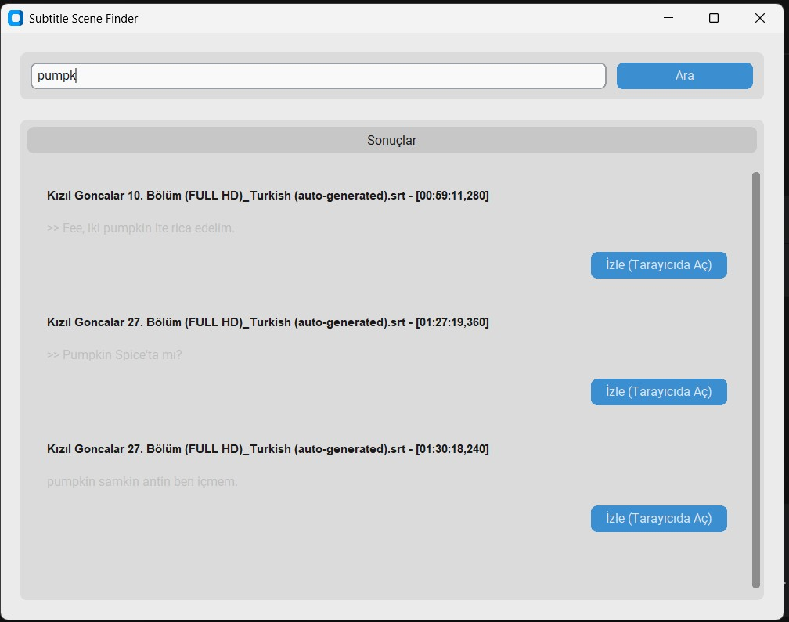

# Pumpkin Spice Latte

Bu uygulama, yerel bilgisayarınızdaki altyazı (.srt) dosyaları içerisinde kelime araması yapmanızı ve bulunan sonuçların ilgili video sahnelerini otomatik olarak açmanızı sağlar.

## Özellikler

*   **Hızlı Arama:** Klasördeki tüm altyazı dosyalarında saniyeler içinde arama yapar.
*   **Akıllı Eşleşme:** Bulunan sahnenin hangi bölüme ait olduğunu ve dakikasını tespit eder.
*   **Video Başlatma:** "İzle" butonuna tıkladığınızda, ilgili videoyu (örneğin YouTube üzerinden) tam o saniyeden başlatır.
*   **Modern Arayüz:** Kullanıcı dostu ve şık bir görünüm sunar.

## Gereksinimler

*   **Python 3.x**
*   **Gerekli Kütüphaneler:**
    ```bash
    pip install customtkinter pandas openpyxl packaging
    ```

## Dosya Yapısı

Uygulamanın çalışması için aşağıdaki dosya yapısının korunması gerekir:

*   `main.py`: Çalıştırılabilir ana uygulama dosyası.
*   `logic.py`: Arka plan işlemlerini yapan modül.
*   `bolumler.xlsx`: Videoların başlıklarını ve URL'lerini içeren Excel dosyası.
    *   *Gerekli Sütunlar:* `Title`, `Video url`
*   `srts/`: Tüm `.srt` altyazı dosyalarının bulunduğu klasör.

## Nasıl Kullanılır?

1.  Proje klasöründe bir terminal veya komut satırı açın.
2.  Uygulamayı başlatın:
    ```bash
    python main.py
    ```
3.  Arama kutusuna bir kelime veya cümle yazın ve **Ara** butonuna basın (veya Enter'a basın).
4.  Listelenen sonuçlardan istediğiniz sahnenin **İzle** butonuna tıklayın.
5.  Video tarayıcınızda ilgili saniyede açılacaktır.


# Subtitle Search & Scene Finder

Bu uygulama, yerel bilgisayarınızdaki `.srt` altyazı dosyaları içinde hızlı ve akıllı kelime araması yapmanızı ve eşleşen sahneleri doğrudan videoda açmanızı sağlayan modern bir masaüstü aracıdır.

## 🚀 Özellikler

* **Hızlı Arama:** Klasördeki tüm altyazı dosyalarında saniyeler içinde tarama yapar.
* **Akıllı Eşleşme:** Kelimenin geçtiği sahnenin hangi bölümde, hangi dakika–saniyede olduğunu otomatik tespit eder.
* **Anında Video Açma:** “İzle” butonu ile o sahneyi tam geçtiği saniyeden itibaren (ör. YouTube URL parametreleriyle) başlatabilirsiniz.
* **Modern Arayüz:** CustomTkinter tabanlı şık ve kullanıcı dostu arayüz.

## 🎬 Örnek Kullanım

### Kızıl Goncalar — Sadi Hüdayi’nin Pumpkin Spice Latte Sahneleri

Diyelim ki Sadi Hüdayi’nin *Pumpkin Spice Latte*’yi höpürdettiği sahneleri bulmak istiyorsunuz. Tek yapmanız gereken arama kutusuna şunu yazmak:

> Pumpkin

Ardından **Ara** tuşuna basın. Uygulama, tüm altyazı dosyalarında "Pumpkin" kelimesini arar, kelimenin geçtiği sahneleri listeler ve her bir sonuç için:

* Hangi bölümde geçtiğini,
* Altyazı zaman aralığını,
* Hemen “İzle” butonuyla sahneyi açma imkânını sunarak sizi direkt ilgili ana götürür.

---

### 📸 Ekran Görüntüleri

Sadi Hüdayi Pumpkin Spice Latte içerken


"Pumpkin" kelimesi arandığında uygulamanın ekran görüntüsünü



---

## 📁 Dosya Yapısı

Uygulamanın çalışabilmesi için şu yapı gereklidir:

```
project/
│
├── main.py
├── logic.py
├── bolumler.xlsx      # Title ve Video url sütunlarını içermelidir
│
└── srts/
      ├── 1.srt
      ├── 2.srt
      └── ...

      
 ```


## 🛠 Gereksinimler
Python 3.x

Gerekli kütüphaneleri yüklemek için terminalde şu komutu çalıştırın:

```

pip install customtkinter pandas openpyxl packaging
 ```


## ▶️ Nasıl Kullanılır?
Proje klasöründe terminali açın.

Uygulamayı çalıştırın:


```
python main.py
 ```


Arama kutusuna kelime veya ifadeyi yazın ve Ara tuşuna basın.

Listeden bir sahne seçip İzle butonuna tıklayın.

Video otomatik olarak ilgili saniyeden başlar.
